# Quopus

  

  <b># Quopus Commander — A Directory Opus 4 inspired file manager in Python/PyQt6
</b>

## 💰 Buy a License

| License | Price | Duration | PayPal Link |
|---|---|---|---|
| **1 Year Unlimited** | **€5** | 12 months | [paypal.me/lastyletools/5EUR](https://paypal.me/lastyletools/5EUR) |
| **Lifetime Pro Unlimited** | **€10** | unlimited | [paypal.me/lastyletools/10EUR](https://paypal.me/lastyletools/10EUR) |
| **Custom Modules** | **on demand** | Ask for Your own Custom Module for whatever Data handling, nearly everything is possible |

### How it works

1. **Click the PayPal link above** and send the payment  
   (please use *"Friends & Family"*)
2. **Send an email to** `lastyletools@gmail.com` **with the following:**
   - License type (1 Year / Lifetime Pro)
   - PayPal transaction ID
   - Delivery email address (if different from PayPal)
3. **Within 24 hours** you will receive by email:
   - Your personal license key
   - Download link
   - Installation instructions

---

## 📸 Screenshots of the Commodore Based Functions , there is plenty more to discover.

  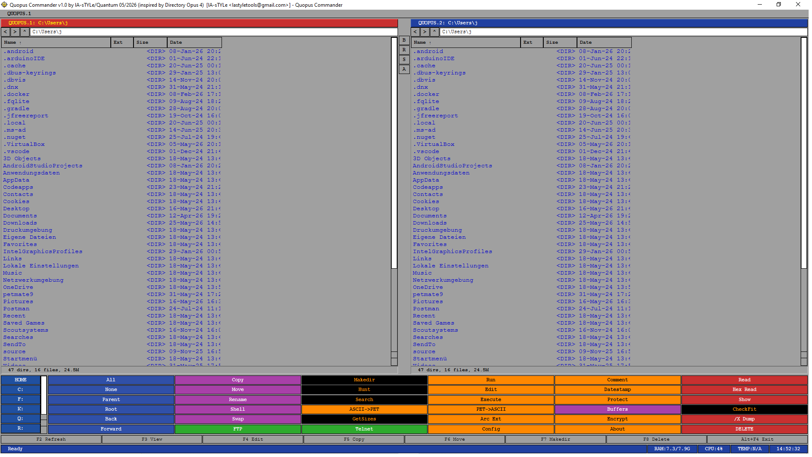

  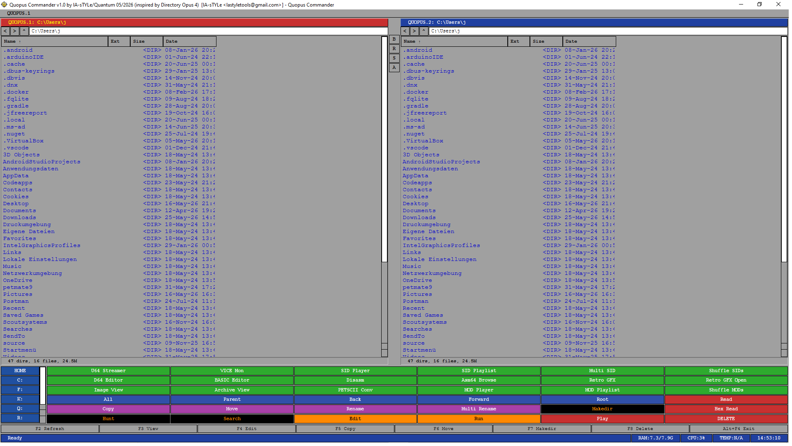
  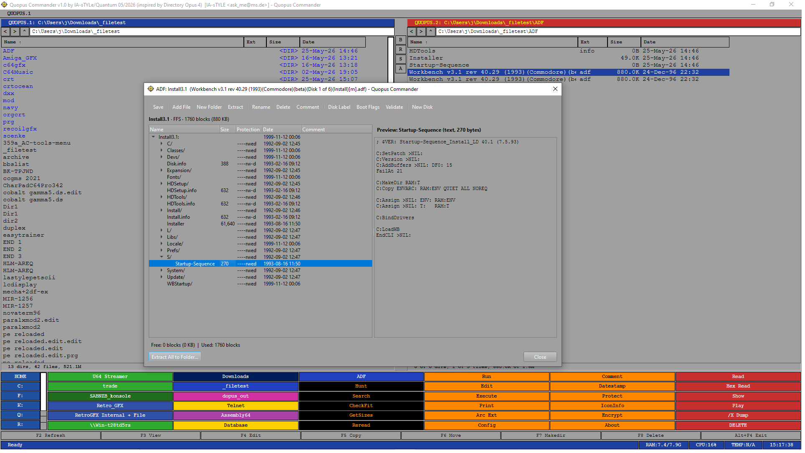
  
  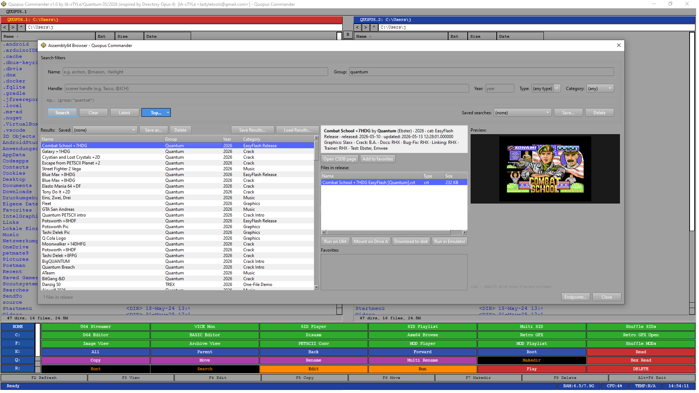
  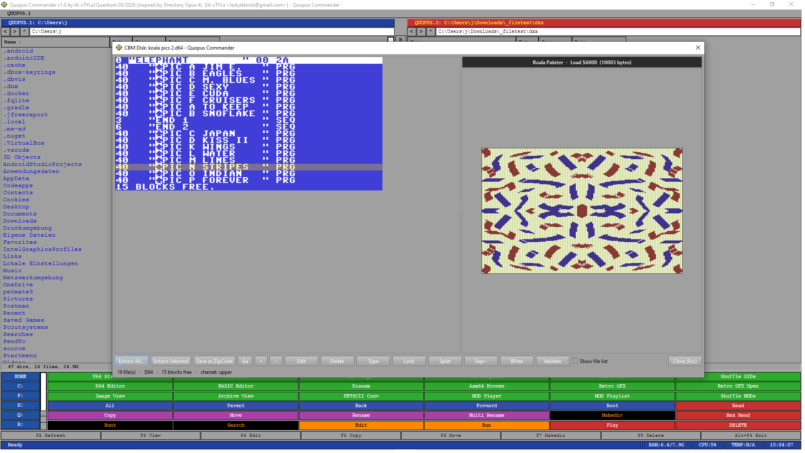
  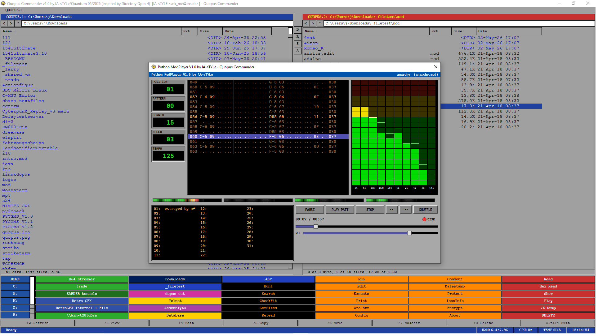
  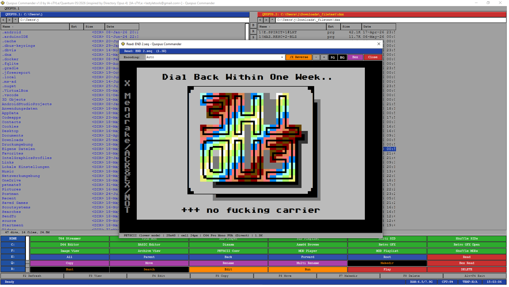
  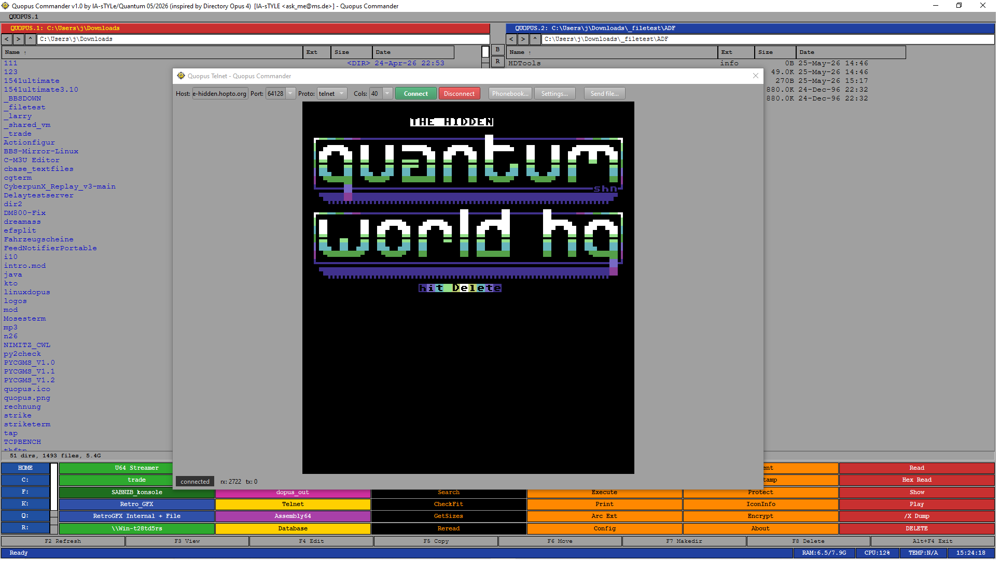
  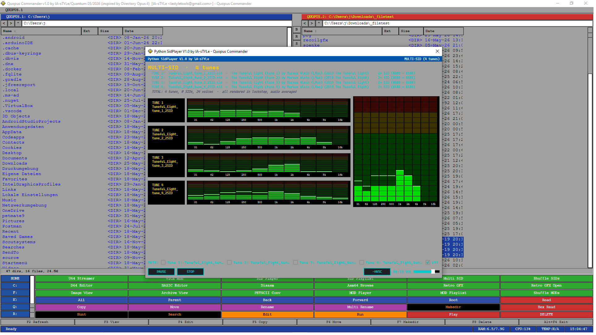
  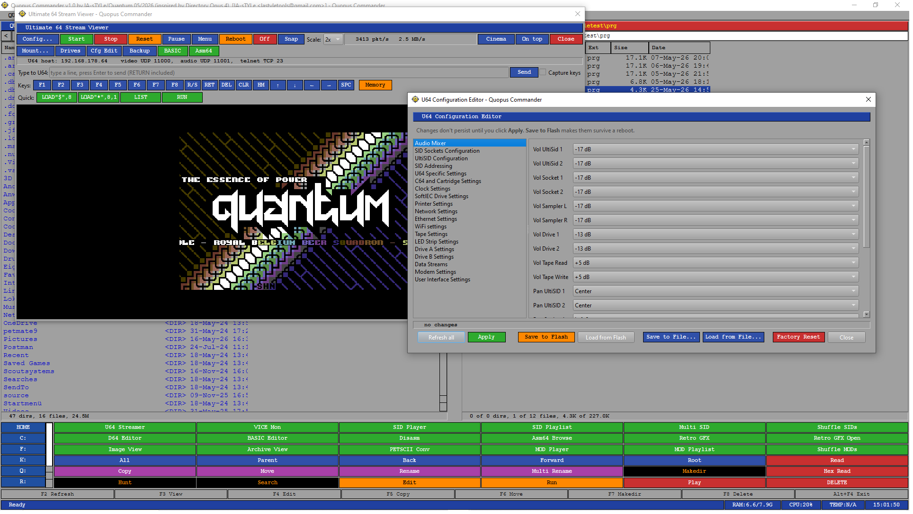
  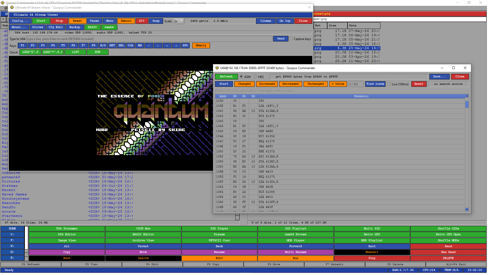

---

## 🚀 Installation

1. Purchase a license (see above) if You want unlimited Features, else there are small Trial limits
2. Use the download link from your confirmation email
3. Extract the archive
4. Enter your license key on first start

---

## 📖 Documentation

See the the included `README.md` for detailed instructions.

---

## ❓ FAQ

**Can I try Quopus before buying?**  
Ofcourse, almost everything works out of the Box

**How long does delivery take?**  
Usually within a few hours, no later than 24h after payment.

**Refunds?**  
Available within 14 days of purchase (EU consumer law).

---

## 🛟 Support

For questions or issues:
- 📧 Email: `lastyletools@gmail.com`
- 🐛 Bugs: [Issues](../../issues)
- 💬 Discussion: [Discussions](../../discussions)

---

## 📜 License

Quopus is proprietary software. A valid license key is required to use all Pro Features without Limitations.  

© 2026 lA-sTYLe / Quantum – All rights reserved.
